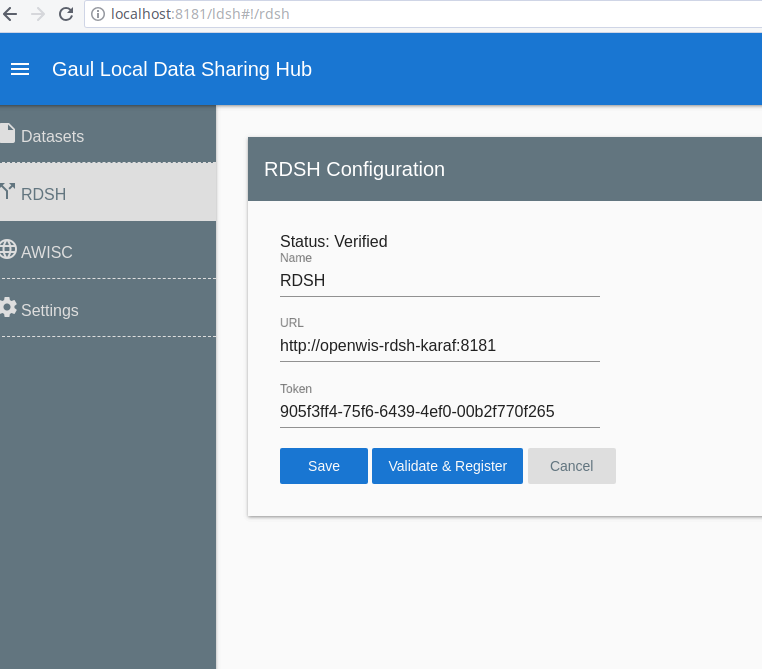
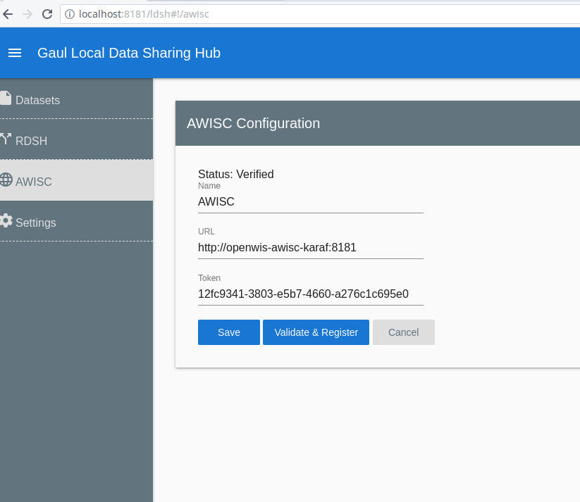
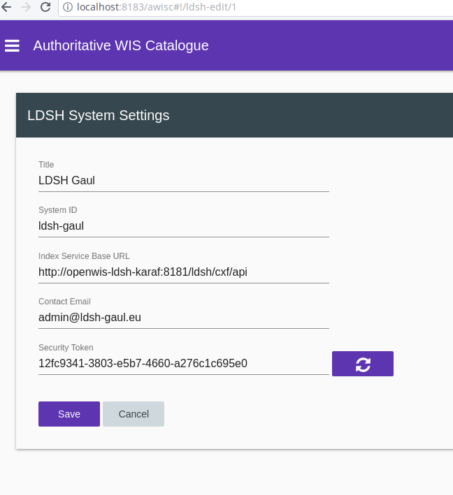

## Introduction

This document will provide information regarding the build and deployment of the [WIS2-PoC-1](https://github.com/OpenWIS/WIS2-PoC-1) applications, LDSH, RDSH, and AWISC.

## Pre-requisites

The following configuration must already exist on the computer that will build and deploy the applications.

Item              | Notes
------------------|------------
Operating System  | Linux/Unix with `bash` shell. The scripts were developed and tested on `Linux Mint 18.3`, but any bash shell should do.
Java 8 SDK        | Either [Oracle](http://www.oracle.com/technetwork/java/javase/downloads/jdk8-downloads-2133151.html) or [OpenJDK](http://openjdk.java.net/install/). The latest version 8 update should be used.
Apache Maven 3.5+ | Available [here](https://maven.apache.org/download.cgi?Preferred=ftp://mirror.reverse.net/pub/apache/).
Docker CE         | Latest version. Available [here](https://www.docker.com/community-edition).

> #### Node.js & Angular
> 
> Node.js and Angular are also used by the project, but the build process will automatically install them locally for each application.

> #### Internet Access
> 
> Unobstructed internet access is required by the build process, as several artifacts will need to be downloaded.

> #### Docker Networking
> 
> Please have a look at [this](Docker-Internet-Connectivity-Problems.md) document if Docker appears unable to connect to the Internet.

> #### Sudo Rights
> 
> The user executing the scripts must be in the `sudoers` group.

## General Information

This section provides useful general information.

### Directory Structure

The `deployment` directory at the root of the project contains all required resources to successfully build and deploy the application. It has the following structure:

Directory         | Notes
------------------|------------
`scripts`         | All build and deployment scripts are located here. It contains sub-directories that group together the scripts for specific items: `awisc`, `ldsh`, `rdsh`, `karaf`, `network`.
`artifacts`       | Many artifacts will be generated when the applications are built and deployed. They will all be residing in the sub-directories of this folder.
`logs`            | When an application is deployed in a Docker container, the karaf server logs are  "exported" here.

### Automated Build And Deployment

The concept behind the automated build and deployment process is summarized in the following points:

1. Each application (AWISC, LDSH, RDSH) and its associated components are created by the execution of a single script. There exist several smaller scripts responsible for the creation of each component, but the end-user doesn't need to concern himself with them.
2. Similar scripts exist for the  stopping, re-starting, and removal of each application, in order to allow for ease-of-use.
3. Each application component is embedded within its own Docker container. This makes them completely independent, and easy to deploy.
4. Communication between the Docker containers is done through the use of a Docker `bridge network`. This way all containers are able to communicate, but they do not need to expose all their ports in the host operating system.
5. Communication from the host operating system to the web interface of the applications is achieved by exposing specific ports.

### Application And Component Containers

The following Docker containers are created for the system's applications and their components.

#### AWISC

Item                | Container Name              | Description
--------------------|-----------------------------|---------------
AWISC Application   | openwis-awisc-karaf         | Contains an Apache Karaf instance with the application deployed, as well as some O/S utilities that assist in deployment.
AWISC Database      | openwis-awisc-mysql         | Contains the MySQL database used by the application. Its data files are stored in the `deployment/artifacts/awisc-mysql` directory.
AWISC Elasticsearch | openwis-awisc-elasticsearch | Contains the Elasticsearch engine used by the application.

#### LDSH

Item                | Container Name              | Description
--------------------|-----------------------------|---------------
LDSH Application    | openwis-ldsh-karaf          | Contains an Apache Karaf instance with the application deployed, as well as some O/S utilities that assist in deployment.
LDSH Database       | openwis-ldsh-mysql          | Contains the MySQL database used by the application. Its data files are stored in the `deployment/artifacts/ldsh-mysql` directory.
LDSH FTPD           | openwis-ldsh-ftpd           | Contains the FTP server used by the application.

#### RDSH

Item                | Container Name              | Description
--------------------|-----------------------------|---------------
RDSH Application    | openwis-rdsh-karaf          | Contains an Apache Karaf instance with the application deployed, as well as some O/S utilities that assist in deployment.
RDSH Database       | openwis-rdsh-mysql          | Contains the MySQL database used by the application. Its data files are stored in the `deployment/artifacts/rdsh-mysql` directory.
RDSH Mosquitto      | openwis-rdsh-mosquitto      | Contains the Mosquitto MQTT broker used by the application.

### Shell Scripts

> #### Script Execution
> 
> It is **very important** to note that the scripts below contain references to directories and other scripts. These references are relative to the script's execution directory. In order for the scripts to behave as expected, they **must** be invoked from within their containing directory.
> For example, suppose that the user is in the `deployment` directory, and wants to execute the `build-karaf.sh` script.
> 
> **DON'T:** 
> ```bash
> ./scripts/karaf/build-karaf.sh
> ```
> **DO:** 
> ```bash
> cd scripts/karaf
> ./build-karaf.sh
> ```

> #### Requirements
> 
> In the tables below, when one script `Requires` another, it means that without executing the "required" script first, the other script will fail.

The following shell scripts are available.

#### Karaf

In order to be able to create the application Docker containers, the Karaf build script must be executed first. It will create a "generic"  Docker image that will be used subsequently by the application scripts.

ID     | File                                                   | Requires                 | Description
-------|--------------------------------------------------------|--------------------------|------------------------
K.1    | `deployment/scripts/karaf/build-karaf.sh`              | -                        | Creates the `openwis-karaf` Docker image.
K.2    | `deployment/scripts/karaf/remove-karaf.sh`             | K.1                      | Removes (forcefully) the `openwis-karaf` Docker image.

##### Other Files

The file `deployment/scripts/karaf/karaf.dockerfile` provides instructions to Docker on how to build the image.

#### Network

ID     | File                                                   | Requires                 | Description
-------|--------------------------------------------------------|--------------------------|------------------------
N.1    | `deployment/scripts/network/build-network.sh`          | -                        | Creates the `openwis-docker-bridge` bridge network, onto which every container will be connected. This script is called explicitly by other scripts when Docker containers are created.

#### AWISC

These are the "main" scripts that affect the application build and deployment as a whole.

ID     | File                                                   | Requires                 | Description                        | Arguments
-------|--------------------------------------------------------|--------------------------|------------------------------------|-----------
A.1    | `deployment/scripts/awisc/install-start-awisc.sh`      | K.1                      | Builds an deploys AWISC            | Accepts an (optional) argument with the `server:port/context-path` that the application will be deployed. More info [here](#building-for-external-deployment)
A.2    | `deployment/scripts/awisc/stop-awisc.sh`               | A.1                      | Stops deployed AWISC containers    | -
A.3    | `deployment/scripts/awisc/restart-awisc.sh`            | A.2                      | Restarts deployed AWISC containers | -
A.4    | `deployment/scripts/awisc/remove-awisc.sh`             | A.1                      | Removes AWISC containers           | -

The scripts below are called by the "main" scripts, and each of them has a specific function

ID     | File                                                              | Description                                    | Arguments
-------|-------------------------------------------------------------------|------------------------------------------------|-----------
A.1.1  | `deployment/scripts/awisc/install/build-awisc-app.sh`             | Builds the AWISC code                          | Accepts an (optional) argument with the `server:port/context-path` that the application will be deployed. More info [here](#building-for-external-deployment)
A.1.2  | `deployment/scripts/awisc/install/build-awisc-mysql.sh`           | Creates the AWISC MySQL container              | -
A.1.3  | `deployment/scripts/awisc/install/build-awisc-elasticsearch.sh`   | Creates the AWISC Elasticsearch container      | -
A.1.4  | `deployment/scripts/awisc/install/build-awisc-karaf.sh`           | Creates the AWISC Karaf container              | -
A.1.5  | `deployment/scripts/awisc/install/start-awisc-mysql.sh`           | Starts the AWISC MySQL container               | -
A.1.6  | `deployment/scripts/awisc/install/start-awisc-elasticsearch.sh`   | Starts the AWISC Elasticsearch container       | -
A.1.7  | `deployment/scripts/awisc/install/start-awisc-karaf.sh`           | Starts the AWISC Karaf container               | -
A.2.1  | `deployment/scripts/awisc/stop/stop-awisc-mysql.sh`               | Stops the AWISC MySQL container                | -
A.2.2  | `deployment/scripts/awisc/stop/stop-awisc-elasticsearch.sh`       | Stops the AWISC Elasticsearch container        | -
A.2.3  | `deployment/scripts/awisc/stop/stop-awisc-karaf.sh`               | Stops the AWISC Karaf container                | -
A.3.1  | `deployment/scripts/awisc/restart/restart-awisc-mysql.sh`         | Restarts the AWISC MySQL container             | -
A.3.2  | `deployment/scripts/awisc/restart/restart-awisc-elasticsearch.sh` | Restarts the AWISC Elasticsearch container     | -
A.3.3  | `deployment/scripts/awisc/restart/restart-awisc-karaf.sh`         | Restarts the AWISC Karaf container             | -
A.4.1  | `deployment/scripts/awisc/remove/remove-awisc-mysql.sh`           | Removes the AWISC MySQL container              | -
A.4.2  | `deployment/scripts/awisc/remove/remove-awisc-elasticsearch.sh`   | Removes the AWISC Elasticsearch container      | -
A.4.3  | `deployment/scripts/awisc/remove/remove-awisc-karaf.sh`           | Removes the AWISC Karaf container              | -

##### Other Files

The files in the `deployment/scripts/awisc/injected` directory are copied into the Docker containers and executed internally.

#### LDSH

These are the "main" scripts that affect the application build and deployment as a whole.

ID     | File                                                   | Requires                 | Description                        | Arguments
-------|--------------------------------------------------------|--------------------------|------------------------------------|-----------
L.1    | `deployment/scripts/ldsh/install-start-ldsh.sh`        | K.1                      | Builds an deploys LDSH             | Accepts an (optional) argument with the `server:port/context-path` that the application will be deployed. More info [here](#building-for-external-deployment)
L.2    | `deployment/scripts/ldsh/stop-ldsh.sh`                 | L.1                      | Stops deployed LDSH containers     | -
L.3    | `deployment/scripts/ldsh/restart-ldsh.sh`              | L.2                      | Restarts deployed LDSH containers  | -
L.4    | `deployment/scripts/ldsh/remove-ldsh.sh`               | L.1                      | Removes LDSH containers            | -

The scripts below are called by the "main" scripts, and each of them has a specific function

ID     | File                                                              | Description                                    | Arguments
-------|-------------------------------------------------------------------|------------------------------------------------|-----------
L.1.1  | `deployment/scripts/ldsh/install/build-ldsh-app.sh`               | Builds the LDSH code                          | Accepts an (optional) argument with the `server:port/context-path` that the application will be deployed. More info [here](#building-for-external-deployment)
L.1.2  | `deployment/scripts/ldsh/install/build-ldsh-mysql.sh`             | Creates the LDSH MySQL container              | -
L.1.3  | `deployment/scripts/ldsh/install/build-ldsh-ftpd.sh`              | Creates the LDSH FTPD container               | -
L.1.4  | `deployment/scripts/ldsh/install/build-ldsh-karaf.sh`             | Creates the LDSH Karaf container              | -
L.1.5  | `deployment/scripts/ldsh/install/start-ldsh-mysql.sh`             | Starts the LDSH MySQL container               | -
L.1.6  | `deployment/scripts/ldsh/install/start-ldsh-ftpd.sh`              | Starts the LDSH FTPD container                | -
L.1.7  | `deployment/scripts/ldsh/install/start-ldsh-karaf.sh`             | Starts the LDSH Karaf container               | -
L.2.1  | `deployment/scripts/ldsh/stop/stop-ldsh-mysql.sh`                 | Stops the LDSH MySQL container                | -
L.2.2  | `deployment/scripts/ldsh/stop/stop-ldsh-ftpd.sh`                  | Stops the LDSH FTPD container                 | -
L.2.3  | `deployment/scripts/ldsh/stop/stop-ldsh-karaf.sh`                 | Stops the LDSH Karaf container                | -
L.3.1  | `deployment/scripts/ldsh/restart/restart-ldsh-mysql.sh`           | Restarts the LDSH MySQL container             | -
L.3.2  | `deployment/scripts/ldsh/restart/restart-ldsh-ftpd.sh`            | Restarts the LDSH FTPD container              | -
L.3.3  | `deployment/scripts/ldsh/restart/restart-ldsh-karaf.sh`           | Restarts the LDSH Karaf container             | -
L.4.1  | `deployment/scripts/ldsh/remove/remove-ldsh-mysql.sh`             | Removes the LDSH MySQL container              | -
L.4.2  | `deployment/scripts/ldsh/remove/remove-ldsh-ftpd.sh`              | Removes the LDSH FTPD container               | -
L.4.3  | `deployment/scripts/ldsh/remove/remove-ldsh-karaf.sh`             | Removes the LDSH Karaf container              | -

##### Other Files

The files in the `deployment/scripts/ldsh/injected` directory are copied into the Docker containers and executed internally.

#### RDSH

These are the "main" scripts that affect the application build and deployment as a whole.

ID     | File                                                   | Requires                 | Description                        | Arguments
-------|--------------------------------------------------------|--------------------------|------------------------------------|-----------
R.1    | `deployment/scripts/rdsh/install-start-rdsh.sh`        | K.1                      | Builds an deploys RDSH             | Accepts an (optional) argument with the `server:port/context-path` that the application will be deployed. More info [here](#building-for-external-deployment)
R.2    | `deployment/scripts/rdsh/stop-rdsh.sh`                 | R.1                      | Stops deployed RDSH containers     | -
R.3    | `deployment/scripts/rdsh/restart-rdsh.sh`              | R.2                      | Restarts deployed RDSH containers  | -
R.4    | `deployment/scripts/rdsh/remove-rdsh.sh`               | R.1                      | Removes RDSH containers            | -

The scripts below are called by the "main" scripts, and each of them has a specific function

ID     | File                                                              | Description                                    | Arguments
-------|-------------------------------------------------------------------|------------------------------------------------|-----------
R.1.1  | `deployment/scripts/rdsh/install/build-rdsh-app.sh`               | Builds the RDSH code                           | Accepts an (optional) argument with the `server:port/context-path` that the application will be deployed. More info [here](#building-for-external-deployment)
R.1.2  | `deployment/scripts/rdsh/install/build-rdsh-mysql.sh`             | Creates the RDSH MySQL container               | -
R.1.3  | `deployment/scripts/rdsh/install/build-rdsh-mosquitto.sh`         | Creates the RDSH Mosquitto container           | -
R.1.4  | `deployment/scripts/rdsh/install/build-rdsh-karaf.sh`             | Creates the RDSH Karaf container               | -
R.1.5  | `deployment/scripts/rdsh/install/start-rdsh-mysql.sh`             | Starts the RDSH MySQL container                | -
R.1.6  | `deployment/scripts/rdsh/install/start-rdsh-mosquitto.sh`         | Starts the RDSH Mosquitto container            | -
R.1.7  | `deployment/scripts/rdsh/install/start-rdsh-karaf.sh`             | Starts the RDSH Karaf container                | -
R.2.1  | `deployment/scripts/rdsh/stop/stop-rdsh-mysql.sh`                 | Stops the RDSH MySQL container                 | -
R.2.2  | `deployment/scripts/rdsh/stop/stop-rdsh-mosquitto.sh`             | Stops the RDSH Mosquitto container             | -
R.2.3  | `deployment/scripts/rdsh/stop/stop-rdsh-karaf.sh`                 | Stops the RDSH Karaf container                 | -
R.3.1  | `deployment/scripts/rdsh/restart/restart-rdsh-mysql.sh`           | Restarts the RDSH MySQL container              | -
R.3.2  | `deployment/scripts/rdsh/restart/restart-rdsh-mosquitto.sh`       | Restarts the RDSH Mosquitto container          | -
R.3.3  | `deployment/scripts/rdsh/restart/restart-rdsh-karaf.sh`           | Restarts the RDSH Karaf container              | -
R.4.1  | `deployment/scripts/rdsh/remove/remove-rdsh-mysql.sh`             | Removes the RDSH MySQL container               | -
R.4.2  | `deployment/scripts/rdsh/remove/remove-rdsh-mosquitto.sh`         | Removes the RDSH Mosquitto container           | -
R.4.3  | `deployment/scripts/rdsh/remove/remove-rdsh-karaf.sh`             | Removes the RDSH Karaf container               | -

##### Other Files

The file `deployment/scripts/rdsh/mosquitto.dockerfile` provides instructions to Docker on how to build the Mosquitto MQTT broker image.
The files in the `deployment/scripts/rdsh/injected` directory are copied into the Docker containers and executed internally.

## Build And Deployment Steps

This section provides information on how to build and deploy the applications.

> #### Project Directory
> 
> The root directory of the project (where it was cloned from Github) will be referenced below as `${PROJECT_DIRECTORY}`

> #### Sudo Password
> 
> The `sudo` command is used quite often within the shell scripts. This will result in pauses where the shell will ask for the sudo password.

### 1. Karaf

The Karaf Docker image must be created before anything else.

From `${PROJECT_DIRECTORY}`, execute:

```bash
cd deployment/scripts/karaf
./build-karaf.sh
```

### 2. AWISC

In order to build and deploy AWISC, from `${PROJECT_DIRECTORY}`, execute:

```bash
cd deployment/scripts/awisc
./install-start-awisc.sh
```

Once all Docker containers are created and started, the user can stop them.
From `${PROJECT_DIRECTORY}`, execute:

```bash
cd deployment/scripts/awisc
./stop-awisc.sh
```

In order to restart the stopped Docker containers, from `${PROJECT_DIRECTORY}`, execute:

```bash
cd deployment/scripts/awisc
./restart-awisc.sh
```

In order to completely remove the Docker containers, from `${PROJECT_DIRECTORY}`, execute:

```bash
cd deployment/scripts/awisc
./remove-awisc.sh
```

### 3. LDSH

In order to build and deploy LDSH, from `${PROJECT_DIRECTORY}`, execute:

```bash
cd deployment/scripts/ldsh
./install-start-ldsh.sh
```

Once all Docker containers are created and started, the user can stop them.
From `${PROJECT_DIRECTORY}`, execute:

```bash
cd deployment/scripts/ldsh
./stop-ldsh.sh
```

In order to restart the stopped Docker containers, from `${PROJECT_DIRECTORY}`, execute:

```bash
cd deployment/scripts/ldsh
./restart-ldsh.sh
```

In order to completely remove the Docker containers, from `${PROJECT_DIRECTORY}`, execute:

```bash
cd deployment/scripts/ldsh
./remove-ldsh.sh
```

### 4. RDSH

In order to build and deploy RDSH, from `${PROJECT_DIRECTORY}`, execute:

```bash
cd deployment/scripts/rdsh
./install-start-rdsh.sh
```

Once all Docker containers are created and started, the user can stop them.
From `${PROJECT_DIRECTORY}`, execute:

```bash
cd deployment/scripts/rdsh
./stop-rdsh.sh
```

In order to restart the stopped Docker containers, from `${PROJECT_DIRECTORY}`, execute:

```bash
cd deployment/scripts/rdsh
./restart-rdsh.sh
```

In order to completely remove the Docker containers, from `${PROJECT_DIRECTORY}`, execute:

```bash
cd deployment/scripts/rdsh
./remove-rdsh.sh
```

## Building For External Deployment

When using Angular, certain assumptions need to be made by the framework in order to correctly serve its static files. To achieve this, it allows the user to specify the `server:port/context-path` that the application will be deployed. By default, the system's applications are built in order to be deployed as follows:

Application | Deployment URL
------------|----------------
LDSH        | http://localhost:8181/ldsh
RDSH        | http://localhost:8182/rdsh
AWISC       | http://localhost:8183/awisc

The above configuration allows all applications to be deployed in a non-conflicting manner on the same machine.

In the case that any of the applications is intended to be deployed on a different URL (e.g. deploy AWISC on `http://awisc.openwis.io`), this can be achieved as follows.

When running the build script, from `${PROJECT_DIRECTORY}`, execute:

```bash
cd deployment/scripts/awisc
./install-start-awisc.sh http://awisc.openwis.io
```

This will build the Angular components in such a way that they can be correctly deployed on that URL.

Similarly, for LDSH:

```bash
cd deployment/scripts/ldsh
./install-start-ldsh.sh http://ldsh.openwis.io
```

And for RDSH:

```bash
cd deployment/scripts/rdsh
./install-start-rdsh.sh http://rdsh.openwis.io
```

## Application Integration

Due to the fact that the Docker containers are connected through a bridge network, special care needs to be taken when the applications are configured to communicate with each other.

### Host To Container

If the default values were used when building the applications, this would result in the user interfaces being accessible **from the host machine** at these URLs:

Application | Deployment URL
------------|----------------
LDSH        | http://localhost:8181/ldsh
RDSH        | http://localhost:8182/rdsh
AWISC       | http://localhost:8183/awisc

This means that opening a browser and typing any of the above URLs would fetch you the correct page.

### Container To Container

But Docker containers are on a different network, and different rules apply. For example, if you could open a browser within LDSH and you wanted to view the RDSH home page, you would have to type this URL: `http://openwis-rdsh-karaf:8181/rdsh`.

This is because the Docker container names are mapped with each other as if they are network hosts, and the **internal** ports become available. If you noticed on the table earlier, RDSH is mapped **to the host** on port **8182**. But internally it exposes port **8181**, and that is the port used by the Docker network bridge.

### Application Configuration

The importance of all the above is that in order to make the applications integrate correctly, the following values need to be entered in specific forms.

#### LDSH To RDSH

In the `RDSH` page of the LDSH application, the `URL` must be set to `http://openwis-rdsh-karaf:8181`.



#### LDSH To AWISC

In the `AWISC` page of the LDSH application, the `URL` must be set to `http://openwis-awisc-karaf:8181`.




#### AWISC To LDSH

In the `Edit LDSH` page of the AWISC application, the `Index Service Base URL` must be set to `http://openwis-ldsh-karaf:8181/ldsh/cxf/api`.


